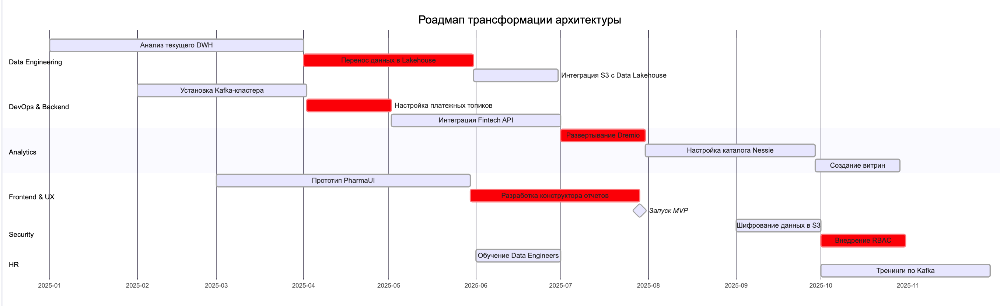
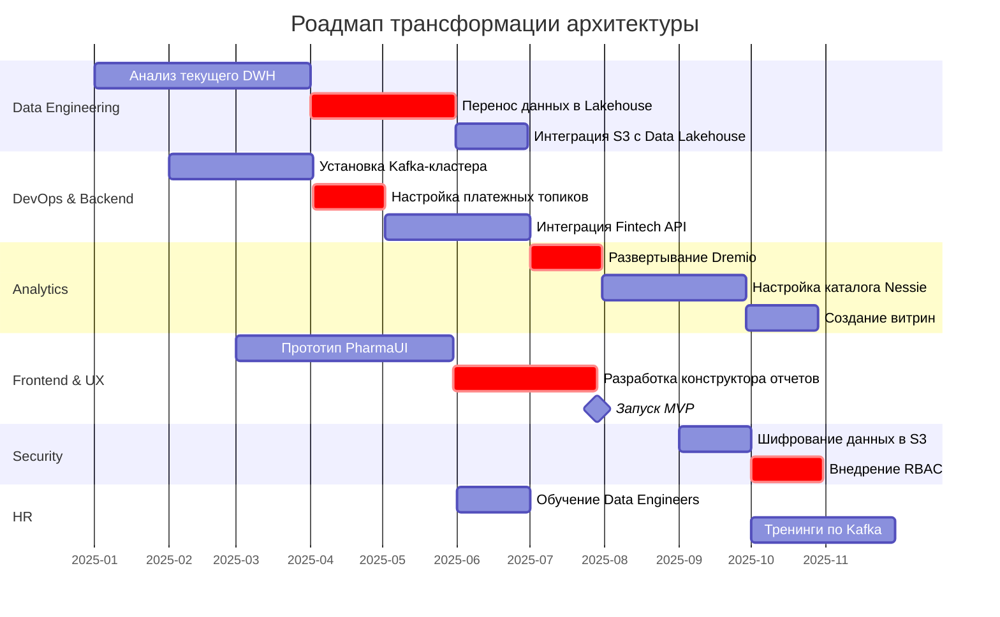

### Технический радар

| **Технология/Методология**      | **Категория** | **Обоснование**                                                                 |
|----------------------------------|---------------|---------------------------------------------------------------------------------|
| Data Lakehouse       | Adopt         | Замена устаревшего DWH. Объединяет структурированные и неструктурированные данные. |
| Apache Kafka                     | Adopt         | Обработка событий в реальном времени. Замена ручного логирования.               |
| Dremio + Nessie                  | Trial         | Упрощение работы с витринами данных. Каталогизация для 152ФЗ-совместимости.      |
| React (PharmaUI)                 | Adopt         | Единый интерфейс для аналитиков. Замена Legacy BI-решений.                     |
| Keycloak                     | Hold          | Уже внедрено. Усилить интеграцию с AD.                                   |
| Data Warehouse      | Retire        | Миграция на Lakehouse в течение 12 месяцев.                                      |
| Redis                            | Hold          | Критичен для быстрых медицинских запросов. Оптимизировать кэширование.         |

---

### Обоснование изменений

#### 1. **Data Lakehouse**  
- **Проблема**: Текущий Azure SQL не поддерживает гибридные нагрузки (структурированные + неструктурированные данные).  
- **Решение**: Lakehouse обеспечивает интеграцию с S3 и аналитику в одном решении.  
- **Эффект**: Сокращение времени подготовки данных для ИИ-моделей.

#### 2. **Apache Kafka**  
- **Проблема**: Ручное логирование событий приводит к потере данных и задержкам.  
- **Решение**: Асинхронная обработка событий (платежи, логи оборудования).  
- **Эффект**: AML-проверки сократятся с 2 часов до 5 минут.

#### 3. **Dremio + Nessie**  
- **Проблема**: Аналитики тратят много времени на поиск и подготовку данных.  
- **Решение**: Единый SQL-интерфейс + каталог данных с версионированием.  
- **Эффект**: Витрины создаются за условные 15 минут вместо 4 часов.

#### 4. **React (PharmaUI)**  
- **Проблема**: Текущие BI-решения требуют участия разработчиков для простых отчетов.  
- **Решение**: Современный портал.  
- **Эффект**: 90% отчетов генерируются бизнес-пользователями.

### Визуализация в mermaid

